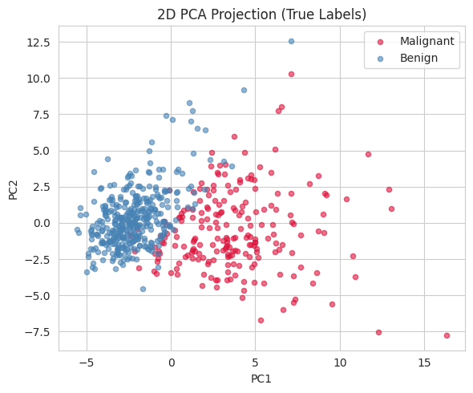
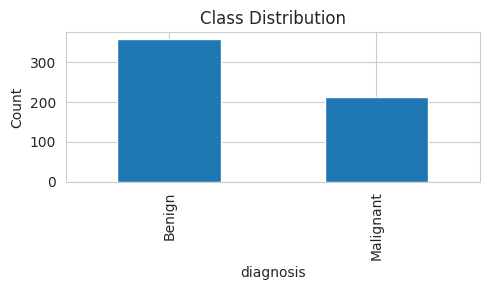
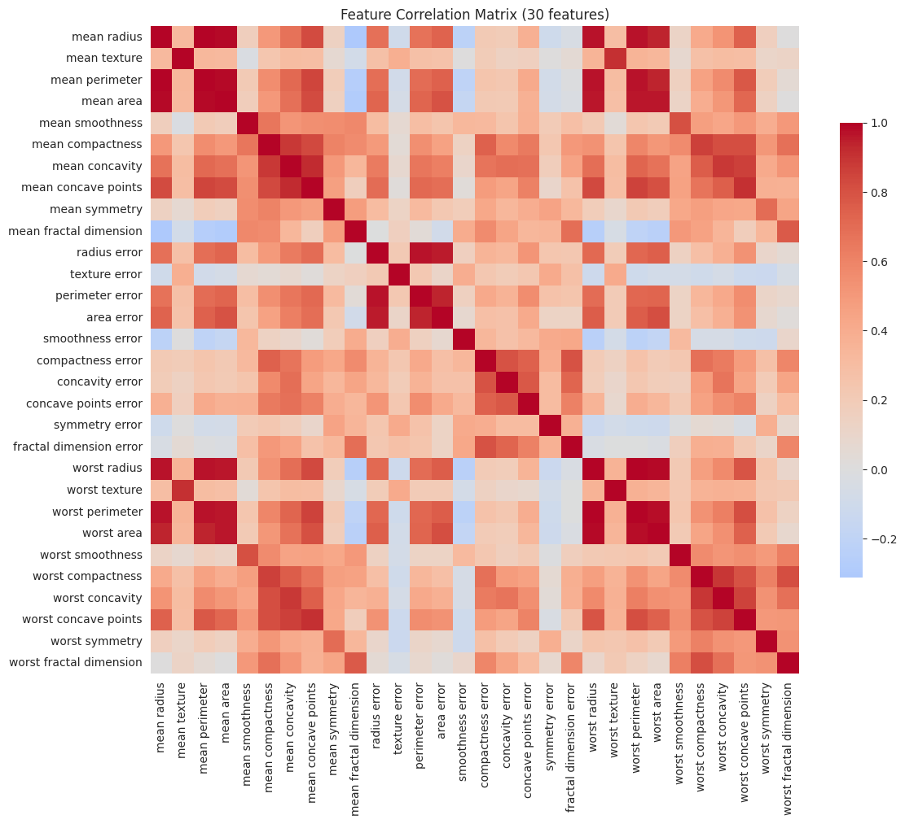
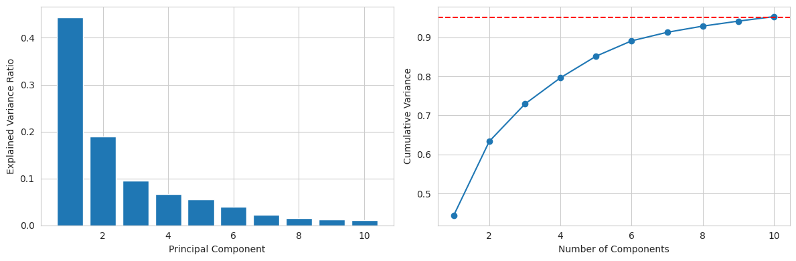
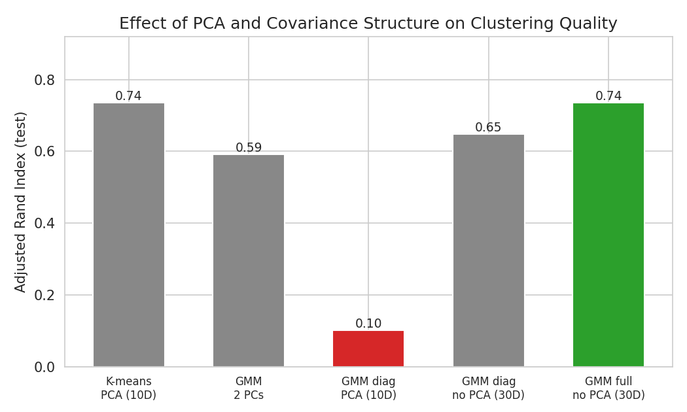
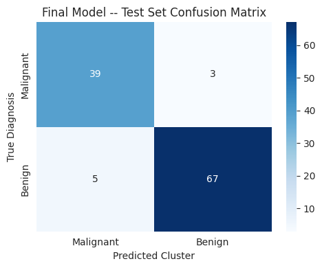
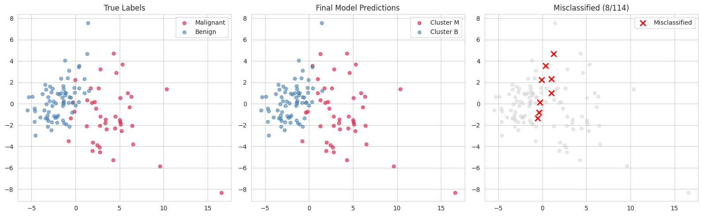

# Bayesian GMM Clustering for Breast Cancer Diagnosis

MATH 345 Probability & Statistics, Spring 2026

**Giorgi Karazanashvili**

## Overview

This project applies a Bayesian Gaussian Mixture Model (GMM) to cluster the Wisconsin Diagnostic Breast Cancer (WDBC) dataset into malignant and benign groups without using diagnosis labels during training. A direct comparison shows that reducing dimensionality with PCA before clustering degrades performance relative to clustering on the full standardized feature set, despite PCA visually appearing to separate the classes well in two dimensions.



## Dataset

The [Wisconsin Diagnostic Breast Cancer dataset](https://archive.ics.uci.edu/ml/datasets/Breast+Cancer+Wisconsin+(Diagnostic)) (via `sklearn.datasets.load_breast_cancer`) consists of 569 samples, each described by 30 features derived from cell-nucleus measurements in fine-needle aspirate biopsies: 10 base measurements (radius, texture, perimeter, area, smoothness, compactness, concavity, concave points, symmetry, fractal dimension), each summarized by its mean, standard error, and "worst" (mean of the three largest) value.



Many of the 30 features are highly correlated (e.g. radius, perimeter, and area all measure size), which motivated testing PCA as a preprocessing step.



## Approach

### PCA branch

A PCA projection retaining 95% of variance was fit on the training set, reducing the feature space from 30 to 10 dimensions.



### Model

A two-component Gaussian Mixture Model was fit via Expectation-Maximization, with covariance type (full vs. diagonal) and preprocessing (raw 30D features vs. PCA at various dimensionalities) varied as ablations. Cluster identity is arbitrary in unsupervised fitting, so predicted cluster labels were aligned to true diagnosis labels by choosing whichever assignment maximizes agreement before computing accuracy or the confusion matrix. A Bayesian variant (`BayesianGaussianMixture` with a Dirichlet prior) was also fit on the best-performing configuration to confirm the result holds under a Bayesian treatment.

## Results

### Effect of PCA and covariance structure

Five configurations were compared on the held-out test set: K-means and GMM on the PCA-reduced (10D) features, GMM restricted to just the first two principal components, GMM with diagonal covariance on PCA features, and GMM with diagonal and full covariance directly on the raw standardized 30D features.



Full-covariance GMM on the raw 30D features achieves the same ARI (0.74) as K-means on PCA features, without discarding any dimensions. Restricting to PCA features with diagonal covariance performs worst of all configurations (ARI 0.10), despite operating on the same 2D projection that looked visually separable above. PCA's top components, chosen to capture total variance, are not aligned with the directions that separate malignant from benign samples.

### Final model

| Metric | Value |
|---|---|
| Test accuracy | 93.0% |
| Sensitivity (malignant recall) | 92.9% |
| Specificity (benign recall) | 93.1% |
| Adjusted Rand Index (test) | 0.74 |
| Bayesian GMM (Dirichlet prior) ARI | 0.74 |



A Bayesian GMM with a Dirichlet prior, fit on the same 30D features, produced an identical test ARI (0.74) and accuracy (93.0%), confirming the result is robust to the Bayesian formulation.



## Key Findings

- Reconstruction of the malignant/benign split is recoverable from unsupervised structure alone: 93.0% test accuracy without ever observing a diagnosis label during training
- PCA degrades clustering quality on this dataset rather than improving it, because principal components are chosen to maximize total variance, not class separation
- Full covariance on the raw 30-feature space outperforms diagonal covariance and all PCA-reduced variants
- A standard GMM and a Bayesian GMM with a Dirichlet prior produce identical results, confirming the finding is not an artifact of a single optimization run

## Repository Structure

```
├── BreastCancerGMMClustering.ipynb               # Full pipeline (data loading through evaluation)
├── GMM_WDBC_Report_Giorgi_Karazanashvili.pdf      # Report
├── figures/                                       # Result figures
└── README.md
```

## Requirements

```
pip install numpy pandas scikit-learn matplotlib seaborn
```

## How to Run

1. Open `BreastCancerGMMClustering.ipynb` in Jupyter
2. Run all cells top to bottom (no external data download needed; the dataset loads via scikit-learn)

## References

1. W. N. Street, W. H. Wolberg, and O. L. Mangasarian, "Nuclear feature extraction for breast tumor diagnosis," in Proc. IS&T/SPIE, vol. 1905, pp. 861–870, 1993.
2. C. Fraley and A. E. Raftery, "Model-based clustering, discriminant analysis, and density estimation," J. Amer. Statist. Assoc., vol. 97, no. 458, pp. 611–631, 2002.
3. D. M. Blei and M. I. Jordan, "Variational inference for Dirichlet process mixtures," Bayesian Analysis, vol. 1, no. 1, pp. 121–143, 2006.
4. D. Dua and C. Graff, "UCI Machine Learning Repository: Breast Cancer Wisconsin (Diagnostic) Dataset," University of California, Irvine, 2019. [Online]. Available: https://archive.ics.uci.edu/ml/datasets/Breast+Cancer+Wisconsin+(Diagnostic).
5. F. Pedregosa et al., "Scikit-learn: Machine Learning in Python," J. Mach. Learn. Res., vol. 12, pp. 2825–2830, 2011.

## License

MIT
